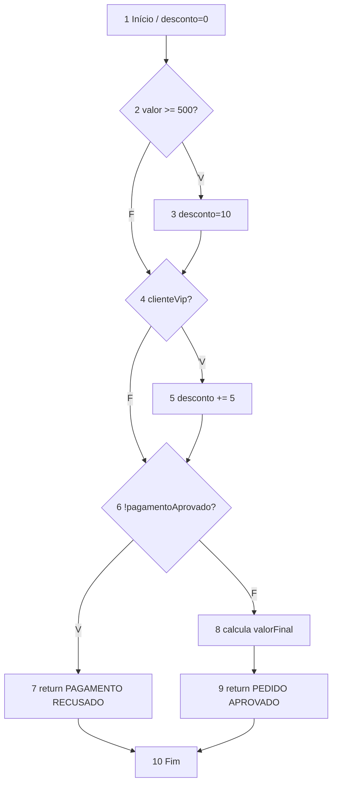
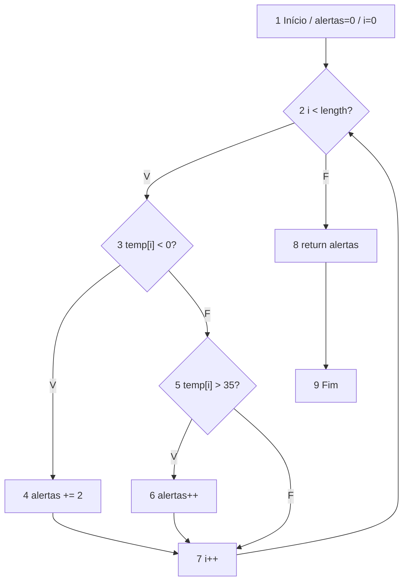

# Diagramas CFG

## Exercício 1

```mermaid
flowchart TD
    A["1 Início / desconto=0"] --> B{"2 valor >= 500?"}
    B -- "V" --> C["3 desconto=10"]
    B -- "F" --> D{"4 clienteVip?"}
    C --> D
    D -- "V" --> E["5 desconto += 5"]
    D -- "F" --> F{"6 !pagamentoAprovado?"}
    E --> F
    F -- "V" --> G["7 return PAGAMENTO RECUSADO"]
    F -- "F" --> H["8 calcula valorFinal"]
    H --> I["9 return PEDIDO APROVADO"]
    G --> J["10 Fim"]
    I --> J
```

## Exercício 2

```mermaid
flowchart TD
    A["1 Início / alertas=0 / i=0"] --> B{"2 i < length?"}
    B -- "V" --> C{"3 temp[i] < 0?"}
    B -- "F" --> H["8 return alertas"]
    C -- "V" --> D["4 alertas += 2"]
    C -- "F" --> E{"5 temp[i] > 35?"}
    E -- "V" --> F["6 alertas++"]
    E -- "F" --> G["7 i++"]
    D --> G
    F --> G
    G --> B
    H --> I["9 Fim"]
```
